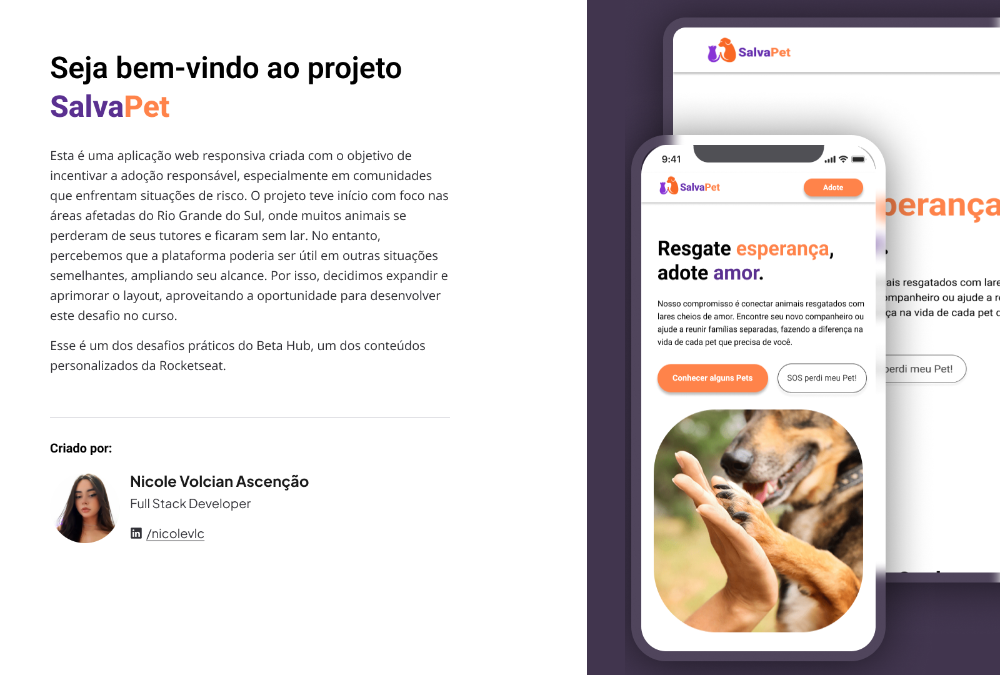

## 📖 Sobre

Esse é um projeto realizado dentro da plataforma da Rocketseat, na trilha personalizada do Beta Hub(em parceria com o Mercado Livre). A proposta foi a criação de um Layout de uma página para um site no Figma, de tema livre. Eu escolhi fazer o design de um projeto no qual já estava desenvolvendo na faculdade, dando uma atenção maior aos detalhes e explorando mais as ferramentas e possibilidades dentro do Figma.

  
    

 

## 🎨 Protótipo

O protótipo deste projeto foi criado no Figma e está disponível para visualização [aqui](https://www.figma.com/design/AhSOXjqHpAu3GGksTSF946/Projeto-de-Design-de-Interface---SalvaPet-2.0?node-id=20-15&t=6JUfUFAFlNIBGhdv-1).
 
E [aqui](https://www.figma.com/design/AhSOXjqHpAu3GGksTSF946/Projeto-de-Design-de-Interface---SalvaPet-2.0?node-id=20-133&t=6JUfUFAFlNIBGhdv-1) a versão do protótipo feita para Mobile.

(Feito com amor por [Nicole Volcian Ascenção](https://www.linkedin.com/in/nicolevlc/) 💜).

 

## 🚀 Visualizar o Projeto

O projeto completo no Figma pode ser visualizado [aqui](https://www.figma.com/design/AhSOXjqHpAu3GGksTSF946/Projeto-de-Design-de-Interface---SalvaPet-2.0?node-id=20-15&t=6JUfUFAFlNIBGhdv-1).

 
